# Houdini City Garden HDA

A procedural garden generator built as a Houdini Digital Asset (HDA).

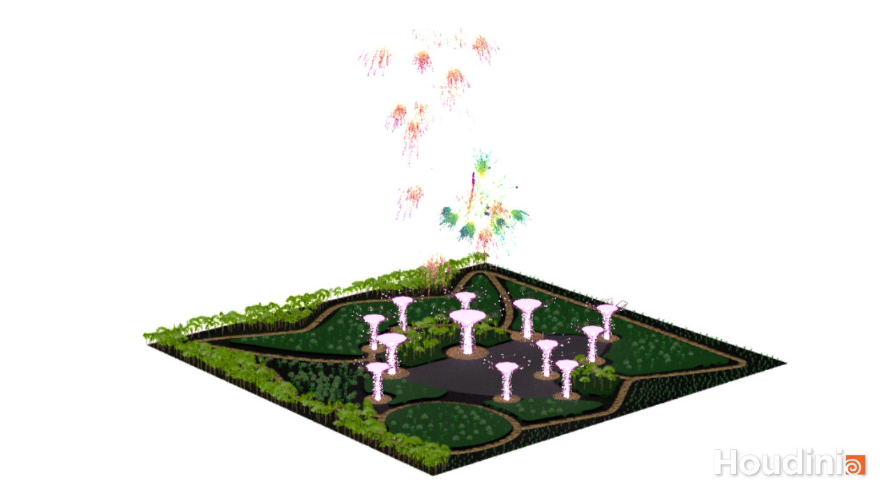

## Overview

**City Garden HDA** is a **Houdini Digital Asset (HDA)** that allows users to create customizable garden structures, inspired by the Supertree Grove at Singapore's Gardens by the Bay. This tool is designed for artists and designers who want to generate complex, interactive garden layouts with minimal manual effort.

This HDA is inspired by **Singapore's Gardens by the Bay -- Supertree Grove**.

## ✨ Features

* **Procedural Supertrees** – Inspired by Singapore’s iconic vertical gardens, with customizable height, radius, materials, and lighting.
* **Plant Distribution** – Paint areas to populate palm trees, orchids, grass, and bushes dynamically.
* **Stone Pathways** – Draw paths using Houdini’s curve tools, with adjustable stone size, spacing, and materials.
* **Fireworks System** – An optional feature for festive scenes, with customizable colors and intensity.
* **Terrain Adaptation** – The garden layout automatically conforms to uneven landscapes.
* **Custom Geometry & Materials** – Users can swap default assets with external geometry for unique designs.

## 🔧 Usage

### 📥 Installation

1. Download the **City Garden HDA** file (`sop_city_garden.1.1.hdanc`).
2. In Houdini, go to **Windows → Asset Manager** and **Install Library**.
3. Load the asset by creating a `city_garden` node in SOPs.

### 🌱 Setting Up the Garden

1. **Adjust Terrain**: Set ground size and color.
2. **Add Supertrees**: Toggle placement mode and click to add/remove Supertrees.
3. **Create Stone Paths**: Use the curve tool to draw procedural pathways.
4. **Paint Plants**: Use the painting tool to populate the garden with trees, orchids, grass, and bushes.
5. **Fireworks** *(Optional)*: Enable and tweak color gradients for celebration scenes.
6. **Render**: Use **Karma CPU** for high-quality rendering with physical sky settings.

Refer to the HDA help card for more details.

## 🎥 Demo

### View full timelapse demo [here](https://youtu.be/CyMr2AO3vH8).

| Feature    | Overview                                    |
| ---------- | ------------------------------------------- |
| Supertrees |   |
| Stone Path |   |
| Plants     |       |
| Area Patch |   |
| Fireworks  | 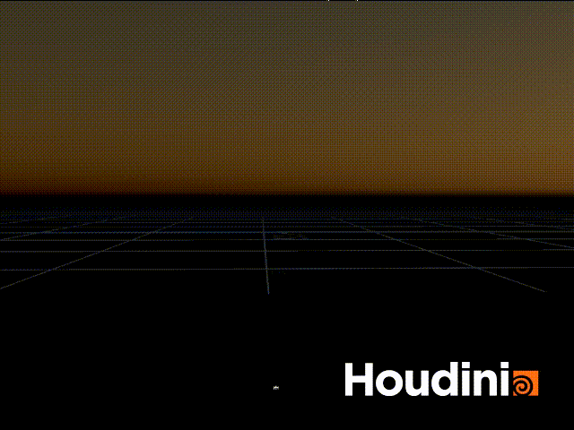 |

### View full timelapse demo [here](https://youtu.be/CyMr2AO3vH8).

## 📸 Gallery

  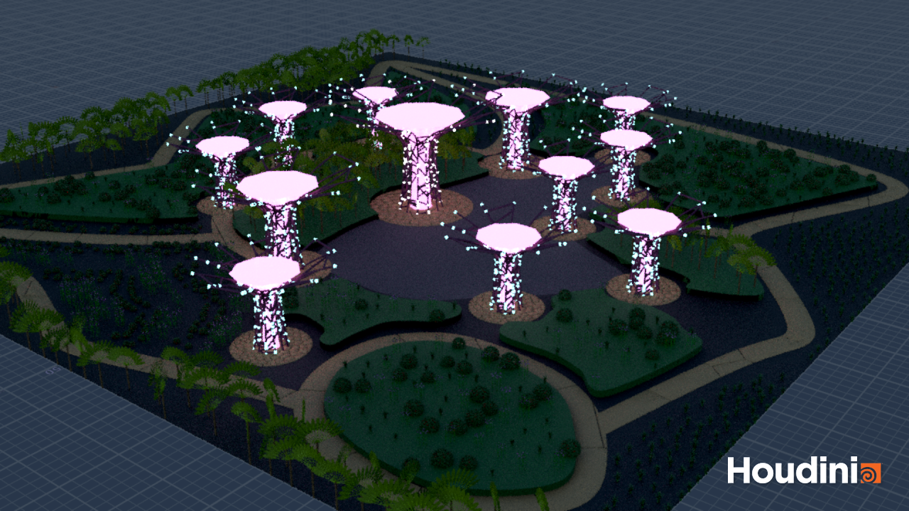
  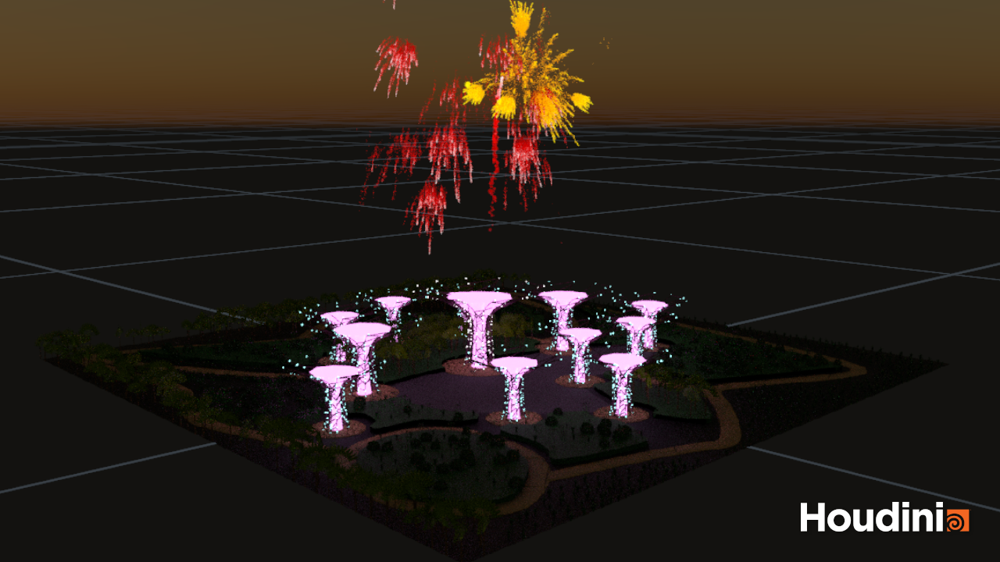

  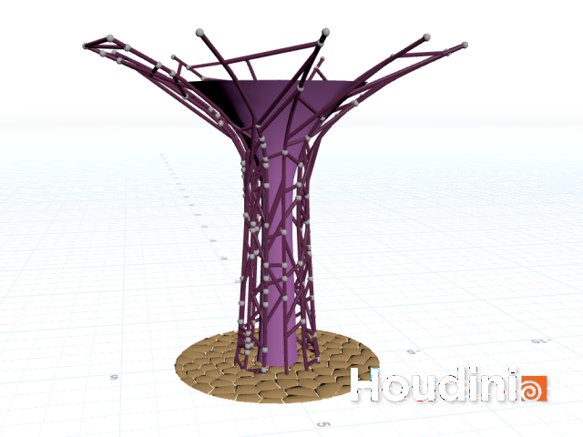
  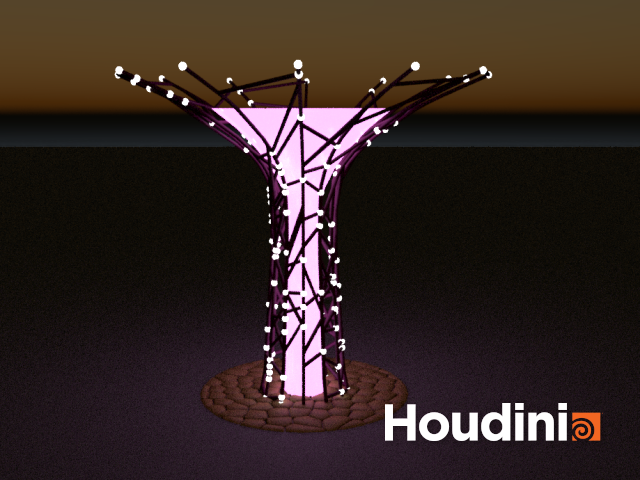

  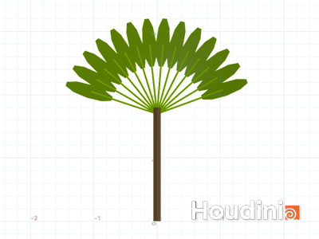
  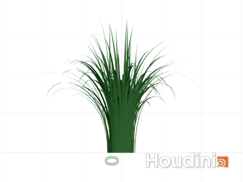

  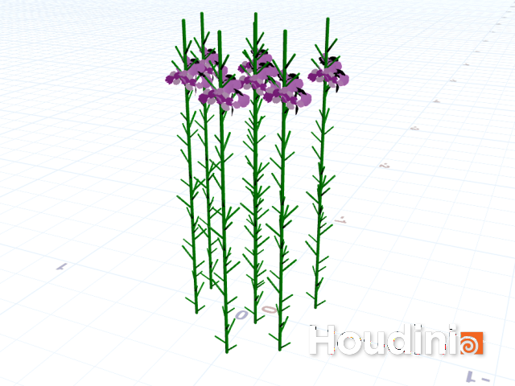
  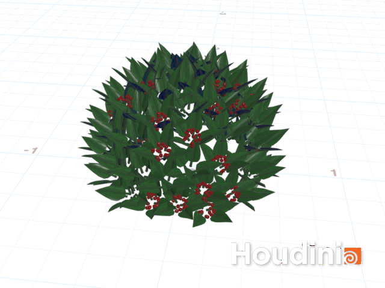

  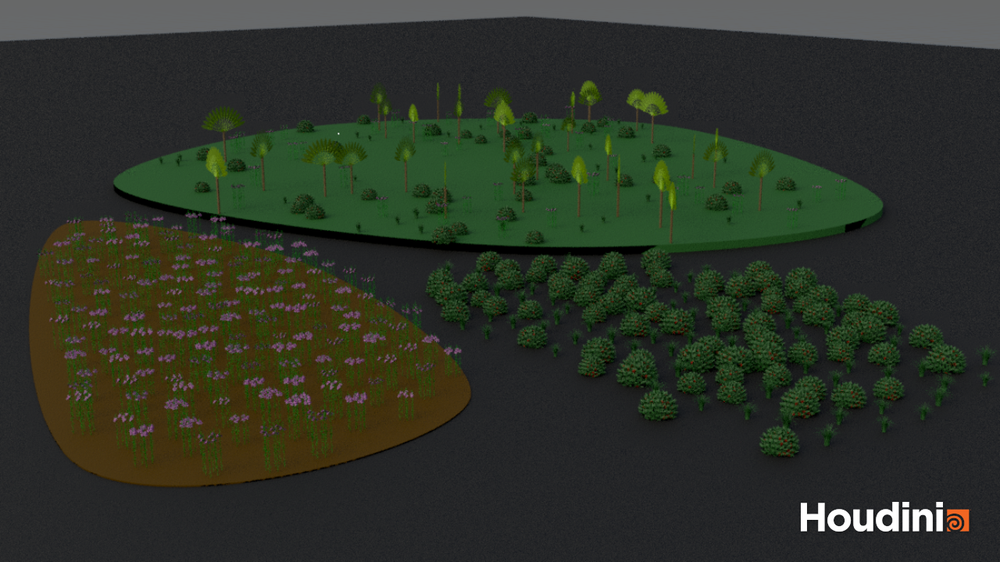

## 📬 Contact

For inquiries, reach out to:
*  **anu.kriti.w@gmail.com**
*  [**anukritiw**](https://www.linkedin.com/in/anukritiw/)
